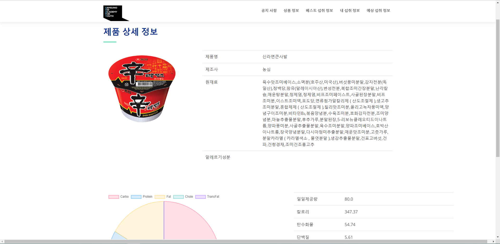

[Web BackEnd PJT] 안전 먹거리 Project - SafeFood (2019.09.26)
================================================================
### <구현기능>
> 기본 기능
>> 1. 식품정보 관리
>>> * 메인페이지
>>> * 식품명 검색
>>> * 식품 목록 검색
>>> * 식품 상세 검색
>> 2. 회원관리(로그인/로그아웃)
>>> * 회원정보 등록
>>> * 회원정보 수정
>>> * 회원정보 삭제
>>> * 회원정보 검색
>>> * 로그인/로그아웃
>> 3. 추가된 사항
>>> * 비밀번호 찾기
>>> * 내 섭취 목록 (섭취 식품 저장)
>>> * 회원별 섭취 목록 관리를 위한 DB 설계.
>>> * Mybatis로 변경.

* **메인 페이지**
 

* **제품 상세 페이지**
 

* **상품 정보 페이지**
 

* **개인 섭취 목록 페이지**
 - "상품정보"탭에서 원하는 상품의 "섭취하기" 버튼을 클릭하면 상품코드를 리스트에 담고, 원하는 만큼 담은 후 "내 섭취 정보"탭에 들어가면면 지금까지 섭취한 리스트를 확인할 수 있음.

* **로그인 페이지**
 

* **비밀번호 찾기 페이지**
 

* **회원가입 페이지**
 

* **회원정보 페이지**
 

* **회원별 섭취 목록 관리를 위한 DB**
 

